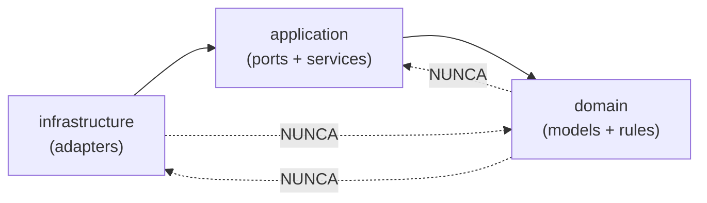
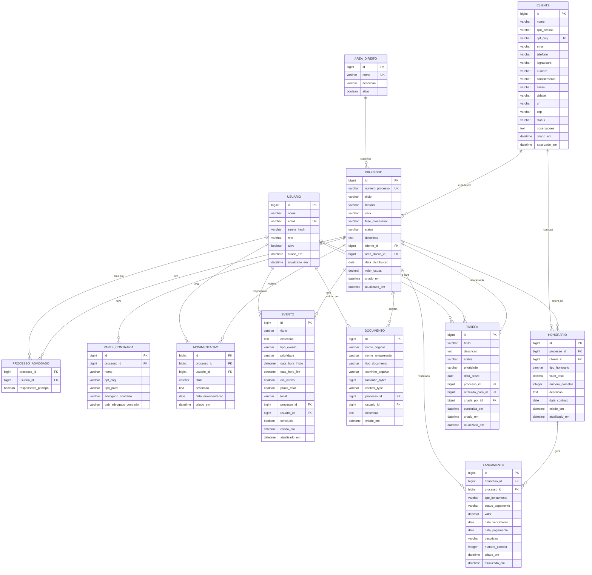
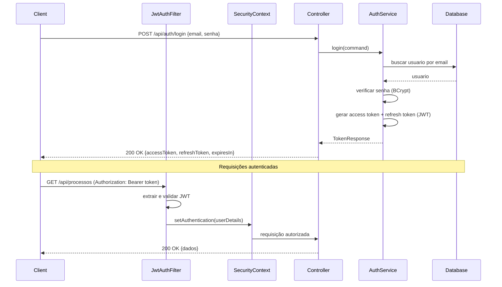

# ADVO — Sistema de Gerenciamento de Serviços Jurídicos

Back-end para gerenciamento de escritório de advocacia, construído com **Java 25**, **Spring Boot 4.1**, **Spring Security**, **JPA/Hibernate**, **Flyway** e **MariaDB**, seguindo a **Arquitetura Hexagonal** (Ports & Adapters).

---

## Premissas Definidas

| # | Decisão | Definição |
|---|---|---|
| 1 | Áreas do Direito | Sim, com entidade `AreaDireito` configurável (Cível, Trabalhista, Criminal etc.) |
| 2 | Multi-tenancy | **Single-tenant** — um único escritório |
| 3 | Integração com tribunais | **Não** nesta fase. A arquitetura hexagonal permite adicionar adaptadores futuramente (PJe, e-SAJ) |
| 4 | Upload de documentos | **Sistema de arquivos local**, com porta abstrata preparada para trocar para S3/GCS |

---

## 1. Funcionalidades Planejadas

### 1.1 Autenticação e Segurança
| Funcionalidade | Descrição |
|---|---|
| Login com JWT | Autenticação stateless com access token + refresh token |
| Roles (RBAC) | `ADMIN`, `ADVOGADO`, `ESTAGIARIO`, `SECRETARIA` |
| Registro de Usuários | Apenas ADMIN pode criar novos usuários |
| Alteração de Senha | O próprio usuário altera, ADMIN pode forçar reset |
| Logout / Token Blacklist | Invalidação de tokens via blacklist em memória |

### 1.2 Gestão de Clientes
| Funcionalidade | Descrição |
|---|---|
| Cadastro PF/PJ | CPF/CNPJ, dados de contato, endereço |
| Busca e Filtros | Por nome, documento, status |
| Histórico de Processos | Visualizar todos os processos de um cliente |
| Status do Cliente | Ativo / Inativo / Prospecto |

### 1.3 Gestão de Processos (Casos)
| Funcionalidade | Descrição |
|---|---|
| Cadastro de Processo | Número, tribunal, vara, área do direito, partes |
| Fases do Processo | Workflow: `INICIAL → INSTRUÇÃO → JULGAMENTO → RECURSO → ENCERRADO` |
| Movimentações | Registro de andamentos processuais com data e descrição |
| Advogados Responsáveis | Associação de um ou mais advogados ao caso |
| Parte Contrária | Registro das partes adversárias |
| Status | `ATIVO`, `ARQUIVADO`, `SUSPENSO`, `ENCERRADO` |

### 1.4 Agenda e Prazos
| Funcionalidade | Descrição |
|---|---|
| Compromissos | Audiências, reuniões, prazos judiciais |
| Tipos de Evento | `AUDIENCIA`, `REUNIAO`, `PRAZO_JUDICIAL`, `PRAZO_INTERNO`, `DILIGENCIA` |
| Alertas de Prazo | Marcação de prazos fatais vs. ordinários |
| Vínculo com Processo | Cada evento pode estar vinculado a um processo |

### 1.5 Gestão de Documentos (Metadados)
| Funcionalidade | Descrição |
|---|---|
| Upload de Arquivos | Upload com metadados (tipo, descrição, processo) |
| Tipos de Documento | Petição, Contrato, Procuração, Ofício, Outros |
| Vínculo com Processo | Cada documento vinculado a um processo |
| Download | Recuperação do arquivo pelo ID |

### 1.6 Financeiro
| Funcionalidade | Descrição |
|---|---|
| Honorários | Registro de contratos de honorários por processo |
| Lançamentos | Receitas e despesas vinculadas a processos |
| Status de Pagamento | `PENDENTE`, `PAGO`, `ATRASADO`, `CANCELADO` |
| Relatório Financeiro | Totalizadores por período, cliente, processo |

### 1.7 Tarefas
| Funcionalidade | Descrição |
|---|---|
| Criação de Tarefas | Atribuição a usuários com prazo |
| Status | `PENDENTE`, `EM_ANDAMENTO`, `CONCLUIDA`, `CANCELADA` |
| Prioridade | `BAIXA`, `MEDIA`, `ALTA`, `URGENTE` |
| Vínculo com Processo | Cada tarefa pode estar vinculada a um processo |

### 1.8 Dashboard / Relatórios
| Funcionalidade | Descrição |
|---|---|
| Resumo Geral | Processos ativos, prazos próximos, tarefas pendentes |
| Estatísticas | Processos por área, por advogado, por status |
| Financeiro | Receitas vs. Despesas, inadimplência |

---

## 2. Arquitetura Hexagonal — Estrutura de Pacotes

```
src/main/java/dev/rodolfo/advo/
├── shared/                              # Componentes transversais
│   ├── domain/
│   │   ├── Entity.java                  # Classe base para entidades (ID genérico)
│   │   ├── ValueObject.java             # Classe base para value objects
│   │   └── DomainException.java         # Exceção base de domínio
│   ├── application/
│   │   └── UseCase.java                 # Interface funcional base para use cases
│   └── infrastructure/
│       └── config/
│           └── GlobalExceptionHandler.java
│
├── auth/                                # Módulo de Autenticação
│   ├── domain/
│   │   ├── model/
│   │   │   ├── Usuario.java
│   │   │   ├── Role.java                # Enum
│   │   │   ├── Email.java               # Value Object
│   │   │   └── Senha.java               # Value Object
│   │   ├── exception/
│   │   │   ├── CredenciaisInvalidasException.java
│   │   │   └── UsuarioNaoEncontradoException.java
│   │   └── service/
│   │       └── AutenticacaoService.java # Lógica de domínio pura
│   ├── application/
│   │   ├── port/
│   │   │   ├── in/
│   │   │   │   ├── LoginUseCase.java
│   │   │   │   ├── RegistrarUsuarioUseCase.java
│   │   │   │   ├── RefreshTokenUseCase.java
│   │   │   │   └── AlterarSenhaUseCase.java
│   │   │   └── out/
│   │   │       ├── UsuarioRepositoryPort.java
│   │   │       ├── TokenProviderPort.java
│   │   │       └── PasswordEncoderPort.java
│   │   ├── service/
│   │   │   └── AuthApplicationService.java
│   │   └── dto/
│   │       ├── LoginCommand.java
│   │       ├── LoginResult.java
│   │       ├── RegistrarUsuarioCommand.java
│   │       └── TokenResponse.java
│   └── infrastructure/
│       ├── adapter/
│       │   ├── in/
│       │   │   └── web/
│       │   │       └── AuthController.java
│       │   └── out/
│       │       ├── persistence/
│       │       │   ├── UsuarioJpaEntity.java
│       │       │   ├── UsuarioJpaRepository.java
│       │       │   ├── UsuarioMapper.java
│       │       │   └── UsuarioPersistenceAdapter.java
│       │       └── security/
│       │           ├── JwtTokenProvider.java
│       │           └── BcryptPasswordEncoderAdapter.java
│       └── config/
│           ├── SecurityConfig.java
│           └── JwtAuthenticationFilter.java
│
├── cliente/                             # Módulo de Clientes
│   ├── domain/
│   │   ├── model/
│   │   │   ├── Cliente.java
│   │   │   ├── TipoPessoa.java          # Enum: PF, PJ
│   │   │   ├── StatusCliente.java       # Enum
│   │   │   ├── Cpf.java                 # Value Object com validação
│   │   │   ├── Cnpj.java               # Value Object com validação
│   │   │   └── Endereco.java            # Value Object
│   │   └── exception/
│   │       └── ClienteNaoEncontradoException.java
│   ├── application/
│   │   ├── port/
│   │   │   ├── in/
│   │   │   │   ├── CriarClienteUseCase.java
│   │   │   │   ├── AtualizarClienteUseCase.java
│   │   │   │   ├── BuscarClienteUseCase.java
│   │   │   │   └── ListarClientesUseCase.java
│   │   │   └── out/
│   │   │       └── ClienteRepositoryPort.java
│   │   ├── service/
│   │   │   └── ClienteApplicationService.java
│   │   └── dto/
│   │       ├── CriarClienteCommand.java
│   │       ├── AtualizarClienteCommand.java
│   │       └── ClienteResponse.java
│   └── infrastructure/
│       └── adapter/
│           ├── in/
│           │   └── web/
│           │       └── ClienteController.java
│           └── out/
│               └── persistence/
│                   ├── ClienteJpaEntity.java
│                   ├── ClienteJpaRepository.java
│                   ├── ClienteMapper.java
│                   └── ClientePersistenceAdapter.java
│
├── processo/                            # Módulo de Processos
│   ├── domain/
│   │   ├── model/
│   │   │   ├── Processo.java
│   │   │   ├── Movimentacao.java
│   │   │   ├── ParteContraria.java
│   │   │   ├── StatusProcesso.java      # Enum
│   │   │   ├── FaseProcessual.java      # Enum
│   │   │   └── NumeroProcesso.java      # Value Object (padrão CNJ)
│   │   └── exception/
│   │       └── ProcessoNaoEncontradoException.java
│   ├── application/
│   │   ├── port/
│   │   │   ├── in/
│   │   │   │   ├── CriarProcessoUseCase.java
│   │   │   │   ├── AtualizarProcessoUseCase.java
│   │   │   │   ├── BuscarProcessoUseCase.java
│   │   │   │   ├── ListarProcessosUseCase.java
│   │   │   │   ├── AdicionarMovimentacaoUseCase.java
│   │   │   │   └── AlterarFaseProcessoUseCase.java
│   │   │   └── out/
│   │   │       ├── ProcessoRepositoryPort.java
│   │   │       └── MovimentacaoRepositoryPort.java
│   │   ├── service/
│   │   │   └── ProcessoApplicationService.java
│   │   └── dto/
│   │       ├── CriarProcessoCommand.java
│   │       ├── ProcessoResponse.java
│   │       └── MovimentacaoCommand.java
│   └── infrastructure/
│       └── adapter/
│           ├── in/
│           │   └── web/
│           │       └── ProcessoController.java
│           └── out/
│               └── persistence/
│                   ├── ProcessoJpaEntity.java
│                   ├── MovimentacaoJpaEntity.java
│                   ├── ParteContrariaJpaEntity.java
│                   ├── ProcessoJpaRepository.java
│                   ├── ProcessoMapper.java
│                   └── ProcessoPersistenceAdapter.java
│
├── agenda/                              # Módulo de Agenda/Prazos
│   ├── domain/
│   │   ├── model/
│   │   │   ├── Evento.java
│   │   │   ├── TipoEvento.java          # Enum
│   │   │   └── PrioridadeEvento.java    # Enum
│   │   └── exception/
│   │       └── EventoNaoEncontradoException.java
│   ├── application/
│   │   ├── port/
│   │   │   ├── in/
│   │   │   │   ├── CriarEventoUseCase.java
│   │   │   │   ├── AtualizarEventoUseCase.java
│   │   │   │   ├── ListarEventosUseCase.java
│   │   │   │   └── BuscarPrazosProximosUseCase.java
│   │   │   └── out/
│   │   │       └── EventoRepositoryPort.java
│   │   ├── service/
│   │   │   └── AgendaApplicationService.java
│   │   └── dto/
│   │       ├── CriarEventoCommand.java
│   │       └── EventoResponse.java
│   └── infrastructure/
│       └── adapter/
│           ├── in/
│           │   └── web/
│           │       └── AgendaController.java
│           └── out/
│               └── persistence/
│                   ├── EventoJpaEntity.java
│                   ├── EventoJpaRepository.java
│                   ├── EventoMapper.java
│                   └── EventoPersistenceAdapter.java
│
├── documento/                           # Módulo de Documentos
│   ├── domain/
│   │   ├── model/
│   │   │   ├── Documento.java
│   │   │   └── TipoDocumento.java       # Enum
│   │   └── exception/
│   │       └── DocumentoNaoEncontradoException.java
│   ├── application/
│   │   ├── port/
│   │   │   ├── in/
│   │   │   │   ├── UploadDocumentoUseCase.java
│   │   │   │   ├── BuscarDocumentoUseCase.java
│   │   │   │   └── ListarDocumentosUseCase.java
│   │   │   └── out/
│   │   │       ├── DocumentoRepositoryPort.java
│   │   │       └── ArquivoStoragePort.java
│   │   ├── service/
│   │   │   └── DocumentoApplicationService.java
│   │   └── dto/
│   │       ├── UploadDocumentoCommand.java
│   │       └── DocumentoResponse.java
│   └── infrastructure/
│       └── adapter/
│           ├── in/
│           │   └── web/
│           │       └── DocumentoController.java
│           └── out/
│               ├── persistence/
│               │   ├── DocumentoJpaEntity.java
│               │   ├── DocumentoJpaRepository.java
│               │   ├── DocumentoMapper.java
│               │   └── DocumentoPersistenceAdapter.java
│               └── storage/
│                   └── LocalFileStorageAdapter.java
│
├── financeiro/                          # Módulo Financeiro
│   ├── domain/
│   │   ├── model/
│   │   │   ├── Honorario.java
│   │   │   ├── Lancamento.java
│   │   │   ├── TipoLancamento.java      # Enum: RECEITA, DESPESA
│   │   │   └── StatusPagamento.java     # Enum
│   │   └── exception/
│   │       └── HonorarioNaoEncontradoException.java
│   ├── application/
│   │   ├── port/
│   │   │   ├── in/
│   │   │   │   ├── CriarHonorarioUseCase.java
│   │   │   │   ├── RegistrarLancamentoUseCase.java
│   │   │   │   ├── ListarLancamentosUseCase.java
│   │   │   │   └── GerarRelatorioFinanceiroUseCase.java
│   │   │   └── out/
│   │   │       ├── HonorarioRepositoryPort.java
│   │   │       └── LancamentoRepositoryPort.java
│   │   ├── service/
│   │   │   └── FinanceiroApplicationService.java
│   │   └── dto/
│   │       ├── CriarHonorarioCommand.java
│   │       ├── LancamentoCommand.java
│   │       ├── LancamentoResponse.java
│   │       └── RelatorioFinanceiroResponse.java
│   └── infrastructure/
│       └── adapter/
│           ├── in/
│           │   └── web/
│           │       └── FinanceiroController.java
│           └── out/
│               └── persistence/
│                   ├── HonorarioJpaEntity.java
│                   ├── LancamentoJpaEntity.java
│                   ├── HonorarioJpaRepository.java
│                   ├── LancamentoJpaRepository.java
│                   ├── FinanceiroMapper.java
│                   └── FinanceiroPersistenceAdapter.java
│
└── tarefa/                              # Módulo de Tarefas
    ├── domain/
    │   ├── model/
    │   │   ├── Tarefa.java
    │   │   ├── StatusTarefa.java        # Enum
    │   │   └── PrioridadeTarefa.java    # Enum
    │   └── exception/
    │       └── TarefaNaoEncontradaException.java
    ├── application/
    │   ├── port/
    │   │   ├── in/
    │   │   │   ├── CriarTarefaUseCase.java
    │   │   │   ├── AtualizarTarefaUseCase.java
    │   │   │   ├── ListarTarefasUseCase.java
    │   │   │   └── ConcluirTarefaUseCase.java
    │   │   └── out/
    │   │       └── TarefaRepositoryPort.java
    │   ├── service/
    │   │   └── TarefaApplicationService.java
    │   └── dto/
    │       ├── CriarTarefaCommand.java
    │       └── TarefaResponse.java
    └── infrastructure/
        └── adapter/
            ├── in/
            │   └── web/
            │       └── TarefaController.java
            └── out/
                └── persistence/
                    ├── TarefaJpaEntity.java
                    ├── TarefaJpaRepository.java
                    ├── TarefaMapper.java
                    └── TarefaPersistenceAdapter.java
```

### Direção de Dependências (regra inviolável)



- **domain** → Java puro. Sem dependências Spring, JPA ou qualquer framework.
- **application** → Depende apenas de `domain`. Define interfaces (ports) e DTOs.
- **infrastructure** → Implementa os ports. Usa Spring, JPA, JWT, BCrypt etc.

---

## 3. Modelo de Domínio — Diagrama ER



---

## 4. Migrações Flyway

Todas em `src/main/resources/db/migration/`:

### V1__criar_tabela_usuario.sql
```sql
CREATE TABLE usuario (
    id BIGINT AUTO_INCREMENT PRIMARY KEY,
    nome VARCHAR(255) NOT NULL,
    email VARCHAR(255) NOT NULL UNIQUE,
    senha_hash VARCHAR(255) NOT NULL,
    role VARCHAR(50) NOT NULL DEFAULT 'ADVOGADO',
    ativo BOOLEAN NOT NULL DEFAULT TRUE,
    criado_em DATETIME NOT NULL DEFAULT CURRENT_TIMESTAMP,
    atualizado_em DATETIME NOT NULL DEFAULT CURRENT_TIMESTAMP ON UPDATE CURRENT_TIMESTAMP,
    INDEX idx_usuario_email (email),
    INDEX idx_usuario_role (role)
) ENGINE=InnoDB DEFAULT CHARSET=utf8mb4 COLLATE=utf8mb4_unicode_ci;
```

### V2__criar_tabela_cliente.sql
```sql
CREATE TABLE cliente (
    id BIGINT AUTO_INCREMENT PRIMARY KEY,
    nome VARCHAR(255) NOT NULL,
    tipo_pessoa VARCHAR(2) NOT NULL COMMENT 'PF ou PJ',
    cpf_cnpj VARCHAR(18) NOT NULL UNIQUE,
    email VARCHAR(255),
    telefone VARCHAR(20),
    logradouro VARCHAR(255),
    numero VARCHAR(20),
    complemento VARCHAR(100),
    bairro VARCHAR(100),
    cidade VARCHAR(100),
    uf CHAR(2),
    cep VARCHAR(10),
    status VARCHAR(20) NOT NULL DEFAULT 'ATIVO',
    observacoes TEXT,
    criado_em DATETIME NOT NULL DEFAULT CURRENT_TIMESTAMP,
    atualizado_em DATETIME NOT NULL DEFAULT CURRENT_TIMESTAMP ON UPDATE CURRENT_TIMESTAMP,
    INDEX idx_cliente_nome (nome),
    INDEX idx_cliente_cpf_cnpj (cpf_cnpj),
    INDEX idx_cliente_status (status)
) ENGINE=InnoDB DEFAULT CHARSET=utf8mb4 COLLATE=utf8mb4_unicode_ci;
```

### V3__criar_tabela_area_direito.sql
```sql
CREATE TABLE area_direito (
    id BIGINT AUTO_INCREMENT PRIMARY KEY,
    nome VARCHAR(100) NOT NULL UNIQUE,
    descricao VARCHAR(255),
    ativo BOOLEAN NOT NULL DEFAULT TRUE
) ENGINE=InnoDB DEFAULT CHARSET=utf8mb4 COLLATE=utf8mb4_unicode_ci;

INSERT INTO area_direito (nome, descricao) VALUES
    ('Direito Civil', 'Contratos, responsabilidade civil, família, sucessões'),
    ('Direito Trabalhista', 'Relações de trabalho, reclamações trabalhistas'),
    ('Direito Criminal', 'Defesa criminal, crimes diversos'),
    ('Direito Tributário', 'Planejamento tributário, contencioso fiscal'),
    ('Direito Empresarial', 'Societário, contratos empresariais, recuperação judicial'),
    ('Direito do Consumidor', 'Relações de consumo, CDC'),
    ('Direito Imobiliário', 'Compra e venda, locação, usucapião'),
    ('Direito Previdenciário', 'Aposentadorias, benefícios do INSS'),
    ('Direito Administrativo', 'Licitações, contratos públicos'),
    ('Direito Ambiental', 'Licenciamento, responsabilidade ambiental');
```

### V4__criar_tabela_processo.sql
```sql
CREATE TABLE processo (
    id BIGINT AUTO_INCREMENT PRIMARY KEY,
    numero_processo VARCHAR(25) UNIQUE COMMENT 'Padrão CNJ: NNNNNNN-DD.AAAA.J.TR.OOOO',
    titulo VARCHAR(255) NOT NULL,
    tribunal VARCHAR(100),
    vara VARCHAR(100),
    fase_processual VARCHAR(50) NOT NULL DEFAULT 'INICIAL',
    status VARCHAR(20) NOT NULL DEFAULT 'ATIVO',
    descricao TEXT,
    cliente_id BIGINT NOT NULL,
    area_direito_id BIGINT,
    data_distribuicao DATE,
    valor_causa DECIMAL(15,2),
    criado_em DATETIME NOT NULL DEFAULT CURRENT_TIMESTAMP,
    atualizado_em DATETIME NOT NULL DEFAULT CURRENT_TIMESTAMP ON UPDATE CURRENT_TIMESTAMP,
    CONSTRAINT fk_processo_cliente FOREIGN KEY (cliente_id) REFERENCES cliente(id),
    CONSTRAINT fk_processo_area_direito FOREIGN KEY (area_direito_id) REFERENCES area_direito(id),
    INDEX idx_processo_numero (numero_processo),
    INDEX idx_processo_cliente (cliente_id),
    INDEX idx_processo_status (status),
    INDEX idx_processo_fase (fase_processual)
) ENGINE=InnoDB DEFAULT CHARSET=utf8mb4 COLLATE=utf8mb4_unicode_ci;
```

### V5__criar_tabela_processo_advogado.sql
```sql
CREATE TABLE processo_advogado (
    processo_id BIGINT NOT NULL,
    usuario_id BIGINT NOT NULL,
    responsavel_principal BOOLEAN NOT NULL DEFAULT FALSE,
    PRIMARY KEY (processo_id, usuario_id),
    CONSTRAINT fk_pa_processo FOREIGN KEY (processo_id) REFERENCES processo(id),
    CONSTRAINT fk_pa_usuario FOREIGN KEY (usuario_id) REFERENCES usuario(id)
) ENGINE=InnoDB DEFAULT CHARSET=utf8mb4 COLLATE=utf8mb4_unicode_ci;
```

### V6__criar_tabela_parte_contraria.sql
```sql
CREATE TABLE parte_contraria (
    id BIGINT AUTO_INCREMENT PRIMARY KEY,
    processo_id BIGINT NOT NULL,
    nome VARCHAR(255) NOT NULL,
    cpf_cnpj VARCHAR(18),
    tipo_parte VARCHAR(50) NOT NULL COMMENT 'REU, AUTOR, TERCEIRO etc.',
    advogado_contrario VARCHAR(255),
    oab_advogado_contrario VARCHAR(20),
    CONSTRAINT fk_pc_processo FOREIGN KEY (processo_id) REFERENCES processo(id) ON DELETE CASCADE,
    INDEX idx_pc_processo (processo_id)
) ENGINE=InnoDB DEFAULT CHARSET=utf8mb4 COLLATE=utf8mb4_unicode_ci;
```

### V7__criar_tabela_movimentacao.sql
```sql
CREATE TABLE movimentacao (
    id BIGINT AUTO_INCREMENT PRIMARY KEY,
    processo_id BIGINT NOT NULL,
    usuario_id BIGINT NOT NULL,
    titulo VARCHAR(255) NOT NULL,
    descricao TEXT,
    data_movimentacao DATE NOT NULL,
    criado_em DATETIME NOT NULL DEFAULT CURRENT_TIMESTAMP,
    CONSTRAINT fk_mov_processo FOREIGN KEY (processo_id) REFERENCES processo(id),
    CONSTRAINT fk_mov_usuario FOREIGN KEY (usuario_id) REFERENCES usuario(id),
    INDEX idx_mov_processo (processo_id),
    INDEX idx_mov_data (data_movimentacao)
) ENGINE=InnoDB DEFAULT CHARSET=utf8mb4 COLLATE=utf8mb4_unicode_ci;
```

### V8__criar_tabela_evento.sql
```sql
CREATE TABLE evento (
    id BIGINT AUTO_INCREMENT PRIMARY KEY,
    titulo VARCHAR(255) NOT NULL,
    descricao TEXT,
    tipo_evento VARCHAR(50) NOT NULL,
    prioridade VARCHAR(20) NOT NULL DEFAULT 'MEDIA',
    data_hora_inicio DATETIME NOT NULL,
    data_hora_fim DATETIME,
    dia_inteiro BOOLEAN NOT NULL DEFAULT FALSE,
    prazo_fatal BOOLEAN NOT NULL DEFAULT FALSE,
    local VARCHAR(255),
    processo_id BIGINT,
    usuario_id BIGINT NOT NULL,
    concluido BOOLEAN NOT NULL DEFAULT FALSE,
    criado_em DATETIME NOT NULL DEFAULT CURRENT_TIMESTAMP,
    atualizado_em DATETIME NOT NULL DEFAULT CURRENT_TIMESTAMP ON UPDATE CURRENT_TIMESTAMP,
    CONSTRAINT fk_evento_processo FOREIGN KEY (processo_id) REFERENCES processo(id),
    CONSTRAINT fk_evento_usuario FOREIGN KEY (usuario_id) REFERENCES usuario(id),
    INDEX idx_evento_data (data_hora_inicio),
    INDEX idx_evento_tipo (tipo_evento),
    INDEX idx_evento_usuario (usuario_id),
    INDEX idx_evento_processo (processo_id)
) ENGINE=InnoDB DEFAULT CHARSET=utf8mb4 COLLATE=utf8mb4_unicode_ci;
```

### V9__criar_tabela_documento.sql
```sql
CREATE TABLE documento (
    id BIGINT AUTO_INCREMENT PRIMARY KEY,
    nome_original VARCHAR(255) NOT NULL,
    nome_armazenado VARCHAR(255) NOT NULL UNIQUE,
    tipo_documento VARCHAR(50) NOT NULL,
    caminho_arquivo VARCHAR(500) NOT NULL,
    tamanho_bytes BIGINT NOT NULL,
    content_type VARCHAR(100),
    processo_id BIGINT NOT NULL,
    usuario_id BIGINT NOT NULL,
    descricao TEXT,
    criado_em DATETIME NOT NULL DEFAULT CURRENT_TIMESTAMP,
    CONSTRAINT fk_doc_processo FOREIGN KEY (processo_id) REFERENCES processo(id),
    CONSTRAINT fk_doc_usuario FOREIGN KEY (usuario_id) REFERENCES usuario(id),
    INDEX idx_doc_processo (processo_id),
    INDEX idx_doc_tipo (tipo_documento)
) ENGINE=InnoDB DEFAULT CHARSET=utf8mb4 COLLATE=utf8mb4_unicode_ci;
```

### V10__criar_tabela_honorario.sql
```sql
CREATE TABLE honorario (
    id BIGINT AUTO_INCREMENT PRIMARY KEY,
    processo_id BIGINT NOT NULL,
    cliente_id BIGINT NOT NULL,
    tipo_honorario VARCHAR(50) NOT NULL COMMENT 'FIXO, EXITO, MISTO',
    valor_total DECIMAL(15,2) NOT NULL,
    numero_parcelas INT NOT NULL DEFAULT 1,
    descricao TEXT,
    data_contrato DATE NOT NULL,
    criado_em DATETIME NOT NULL DEFAULT CURRENT_TIMESTAMP,
    atualizado_em DATETIME NOT NULL DEFAULT CURRENT_TIMESTAMP ON UPDATE CURRENT_TIMESTAMP,
    CONSTRAINT fk_hon_processo FOREIGN KEY (processo_id) REFERENCES processo(id),
    CONSTRAINT fk_hon_cliente FOREIGN KEY (cliente_id) REFERENCES cliente(id),
    INDEX idx_hon_processo (processo_id),
    INDEX idx_hon_cliente (cliente_id)
) ENGINE=InnoDB DEFAULT CHARSET=utf8mb4 COLLATE=utf8mb4_unicode_ci;
```

### V11__criar_tabela_lancamento.sql
```sql
CREATE TABLE lancamento (
    id BIGINT AUTO_INCREMENT PRIMARY KEY,
    honorario_id BIGINT,
    processo_id BIGINT,
    tipo_lancamento VARCHAR(20) NOT NULL COMMENT 'RECEITA ou DESPESA',
    status_pagamento VARCHAR(20) NOT NULL DEFAULT 'PENDENTE',
    valor DECIMAL(15,2) NOT NULL,
    data_vencimento DATE NOT NULL,
    data_pagamento DATE,
    descricao VARCHAR(255),
    numero_parcela INT,
    criado_em DATETIME NOT NULL DEFAULT CURRENT_TIMESTAMP,
    atualizado_em DATETIME NOT NULL DEFAULT CURRENT_TIMESTAMP ON UPDATE CURRENT_TIMESTAMP,
    CONSTRAINT fk_lanc_honorario FOREIGN KEY (honorario_id) REFERENCES honorario(id),
    CONSTRAINT fk_lanc_processo FOREIGN KEY (processo_id) REFERENCES processo(id),
    INDEX idx_lanc_vencimento (data_vencimento),
    INDEX idx_lanc_status (status_pagamento),
    INDEX idx_lanc_tipo (tipo_lancamento),
    INDEX idx_lanc_processo (processo_id)
) ENGINE=InnoDB DEFAULT CHARSET=utf8mb4 COLLATE=utf8mb4_unicode_ci;
```

### V12__criar_tabela_tarefa.sql
```sql
CREATE TABLE tarefa (
    id BIGINT AUTO_INCREMENT PRIMARY KEY,
    titulo VARCHAR(255) NOT NULL,
    descricao TEXT,
    status VARCHAR(30) NOT NULL DEFAULT 'PENDENTE',
    prioridade VARCHAR(20) NOT NULL DEFAULT 'MEDIA',
    data_prazo DATE,
    processo_id BIGINT,
    atribuida_para_id BIGINT NOT NULL,
    criada_por_id BIGINT NOT NULL,
    concluida_em DATETIME,
    criado_em DATETIME NOT NULL DEFAULT CURRENT_TIMESTAMP,
    atualizado_em DATETIME NOT NULL DEFAULT CURRENT_TIMESTAMP ON UPDATE CURRENT_TIMESTAMP,
    CONSTRAINT fk_tarefa_processo FOREIGN KEY (processo_id) REFERENCES processo(id),
    CONSTRAINT fk_tarefa_atribuida FOREIGN KEY (atribuida_para_id) REFERENCES usuario(id),
    CONSTRAINT fk_tarefa_criador FOREIGN KEY (criada_por_id) REFERENCES usuario(id),
    INDEX idx_tarefa_status (status),
    INDEX idx_tarefa_prioridade (prioridade),
    INDEX idx_tarefa_prazo (data_prazo),
    INDEX idx_tarefa_atribuida (atribuida_para_id)
) ENGINE=InnoDB DEFAULT CHARSET=utf8mb4 COLLATE=utf8mb4_unicode_ci;
```

### V13__inserir_usuario_admin.sql
```sql
-- Senha padrão: admin123 (BCrypt hash)
INSERT INTO usuario (nome, email, senha_hash, role, ativo) VALUES
    ('Administrador', 'admin@advo.dev', '$2a$10$N.zmdr9k7uOCQb376NoUnuTJ8iAt6Z5EHsM8lE9lBOsl7iKTVKIUi', 'ADMIN', TRUE);
```

---

## 5. Spring Security — JWT + RBAC

### Fluxo de autenticação



### Matriz de autorização

| Rota | Método | Acesso |
|---|---|---|
| `/api/auth/login` | POST | Público |
| `/api/auth/refresh` | POST | Público |
| `/api/auth/**` (demais) | * | Autenticado |
| `/api/usuarios/**` | * | ADMIN |
| `/api/clientes/**` | GET | ADVOGADO, ESTAGIARIO, SECRETARIA, ADMIN |
| `/api/clientes/**` | POST/PUT/DELETE | ADVOGADO, SECRETARIA, ADMIN |
| `/api/processos/**` | GET | ADVOGADO, ESTAGIARIO, SECRETARIA, ADMIN |
| `/api/processos/**` | POST/PUT/DELETE | ADVOGADO, ADMIN |
| `/api/financeiro/**` | * | ADVOGADO, ADMIN |
| `/api/agenda/**` | * | Todos autenticados |
| `/api/documentos/**` | * | Todos autenticados |
| `/api/tarefas/**` | * | Todos autenticados |
| `/api/dashboard/**` | GET | ADVOGADO, ADMIN |

---

## 6. Estratégia de Testes

Estrutura de testes organizada em `src/test/java/dev/rodolfo/advo/`, espelhando a estrutura principal:

```
src/test/java/dev/rodolfo/advo/
├── shared/
│   └── domain/
│       └── EntityTest.java
│
├── auth/
│   ├── domain/
│   │   ├── model/
│   │   │   ├── EmailTest.java              # Validação de formato
│   │   │   ├── SenhaTest.java              # Regras de complexidade
│   │   │   └── UsuarioTest.java            # Regras de negócio do domínio
│   │   └── service/
│   │       └── AutenticacaoServiceTest.java # Lógica pura de autenticação
│   ├── application/
│   │   └── service/
│   │       └── AuthApplicationServiceTest.java # Com mocks dos ports
│   └── infrastructure/
│       └── adapter/
│           ├── in/web/
│           │   └── AuthControllerTest.java     # @WebMvcTest
│           └── out/
│               ├── persistence/
│               │   └── UsuarioPersistenceAdapterTest.java # @DataJpaTest
│               └── security/
│                   └── JwtTokenProviderTest.java
│
├── cliente/
│   ├── domain/
│   │   └── model/
│   │       ├── CpfTest.java                # Validação CPF (dígitos verificadores)
│   │       ├── CnpjTest.java               # Validação CNPJ
│   │       ├── EnderecoTest.java
│   │       └── ClienteTest.java            # Regras de negócio
│   ├── application/
│   │   └── service/
│   │       └── ClienteApplicationServiceTest.java
│   └── infrastructure/
│       └── adapter/
│           ├── in/web/
│           │   └── ClienteControllerTest.java
│           └── out/persistence/
│               └── ClientePersistenceAdapterTest.java
│
├── processo/
│   ├── domain/
│   │   └── model/
│   │       ├── NumeroProcessoTest.java      # Validação padrão CNJ
│   │       ├── ProcessoTest.java            # Transições de fase, regras
│   │       └── MovimentacaoTest.java
│   ├── application/
│   │   └── service/
│   │       └── ProcessoApplicationServiceTest.java
│   └── infrastructure/
│       └── adapter/
│           ├── in/web/
│           │   └── ProcessoControllerTest.java
│           └── out/persistence/
│               └── ProcessoPersistenceAdapterTest.java
│
├── agenda/
│   ├── domain/
│   │   └── model/
│   │       └── EventoTest.java              # Validação datas, prazo fatal
│   ├── application/
│   │   └── service/
│   │       └── AgendaApplicationServiceTest.java
│   └── infrastructure/
│       └── adapter/
│           ├── in/web/
│           │   └── AgendaControllerTest.java
│           └── out/persistence/
│               └── EventoPersistenceAdapterTest.java
│
├── documento/
│   ├── domain/
│   │   └── model/
│   │       └── DocumentoTest.java
│   ├── application/
│   │   └── service/
│   │       └── DocumentoApplicationServiceTest.java
│   └── infrastructure/
│       └── adapter/
│           ├── in/web/
│           │   └── DocumentoControllerTest.java
│           └── out/
│               ├── persistence/
│               │   └── DocumentoPersistenceAdapterTest.java
│               └── storage/
│                   └── LocalFileStorageAdapterTest.java
│
├── financeiro/
│   ├── domain/
│   │   └── model/
│   │       ├── HonorarioTest.java           # Cálculo de parcelas
│   │       └── LancamentoTest.java          # Transições de status
│   ├── application/
│   │   └── service/
│   │       └── FinanceiroApplicationServiceTest.java
│   └── infrastructure/
│       └── adapter/
│           ├── in/web/
│           │   └── FinanceiroControllerTest.java
│           └── out/persistence/
│               └── FinanceiroPersistenceAdapterTest.java
│
└── tarefa/
    ├── domain/
    │   └── model/
    │       └── TarefaTest.java              # Workflow de status
    ├── application/
    │   └── service/
    │       └── TarefaApplicationServiceTest.java
    └── infrastructure/
        └── adapter/
            ├── in/web/
            │   └── TarefaControllerTest.java
            └── out/persistence/
                └── TarefaPersistenceAdapterTest.java
```

### Três níveis de teste

#### Nível 1 — Testes Unitários de Domínio (sem framework)
Testes de Java puro, sem Spring Context, sem mocks de framework. Executam em milissegundos.

| Classe de Teste | O que testa |
|---|---|
| `EmailTest` | E-mails válidos/inválidos, formato, case-insensitive |
| `SenhaTest` | Comprimento mínimo, complexidade |
| `CpfTest` | CPFs válidos (dígitos verificadores), CPFs inválidos, formatação |
| `CnpjTest` | CNPJs válidos/inválidos, formatação |
| `NumeroProcessoTest` | Formato CNJ `NNNNNNN-DD.AAAA.J.TR.OOOO`, validação |
| `UsuarioTest` | Criação, ativação/desativação, troca de role |
| `ClienteTest` | Criação PF/PJ, mudança de status |
| `ProcessoTest` | Transições de fase (validar ordem), mudança de status |
| `EventoTest` | Validação de datas (início < fim), prazo fatal |
| `HonorarioTest` | Cálculo de valor por parcela, validação valores |
| `LancamentoTest` | Transições: PENDENTE→PAGO, PENDENTE→ATRASADO, PENDENTE→CANCELADO |
| `TarefaTest` | Workflow: PENDENTE→EM_ANDAMENTO→CONCLUIDA, data conclusão automática |

#### Nível 2 — Testes Unitários de Application Services (com Mockito)
Usam `@ExtendWith(MockitoExtension.class)` para mockar os ports de saída. Sem Spring Context.

| Classe de Teste | O que testa |
|---|---|
| `AuthApplicationServiceTest` | Login com credenciais válidas/inválidas, geração de tokens, refresh, registro duplicado, alteração de senha |
| `ClienteApplicationServiceTest` | CRUD com validação, busca por filtros, cliente duplicado (CPF/CNPJ), cliente inexistente |
| `ProcessoApplicationServiceTest` | Criação com cliente válido, adição de movimentação, mudança de fase, listagem com filtros |
| `AgendaApplicationServiceTest` | CRUD de eventos, busca por prazos próximos (7 dias), validação de conflitos de horário |
| `DocumentoApplicationServiceTest` | Upload (chamada ao storage + persistência), busca, listagem por processo |
| `FinanceiroApplicationServiceTest` | Criação de honorários, geração automática de parcelas, registro de pagamento, relatório |
| `TarefaApplicationServiceTest` | CRUD, conclusão (atualiza status + data), listagem por usuário/processo |

#### Nível 3 — Testes de Integração (com Spring Context)

**Controllers** (`@WebMvcTest`): Testam serialização JSON, validação de `@Valid`, códigos HTTP, e regras de autorização do Spring Security.

| Classe de Teste | Cenários-chave |
|---|---|
| `AuthControllerTest` | POST login → 200 com token; credenciais inválidas → 401; registro sem ADMIN → 403 |
| `ClienteControllerTest` | CRUD retorna códigos corretos; validação de campos obrigatórios → 400; ESTAGIARIO não pode criar → 403 |
| `ProcessoControllerTest` | CRUD com autorização; ESTAGIARIO pode GET mas não POST → 403 |
| `AgendaControllerTest` | CRUD de eventos; filtro por data |
| `DocumentoControllerTest` | Upload multipart; download retorna bytes |
| `FinanceiroControllerTest` | Apenas ADVOGADO/ADMIN acessam; validação de valores |
| `TarefaControllerTest` | CRUD com atribuição; conclusão de tarefa |

**Persistence Adapters** (`@DataJpaTest`): Testam queries JPA, mapeamentos, e integridade com banco em memória H2.

| Classe de Teste | Cenários-chave |
|---|---|
| `UsuarioPersistenceAdapterTest` | Salvar, buscar por email, email duplicado lança exceção |
| `ClientePersistenceAdapterTest` | Salvar PF/PJ, buscar por CPF/CNPJ, filtrar por status |
| `ProcessoPersistenceAdapterTest` | Salvar com FK válida, buscar por número, listar por cliente |
| `EventoPersistenceAdapterTest` | Salvar, buscar por intervalo de datas |
| `DocumentoPersistenceAdapterTest` | Salvar, listar por processo |
| `FinanceiroPersistenceAdapterTest` | Salvar honorário com parcelas, buscar lançamentos por vencimento |
| `TarefaPersistenceAdapterTest` | Salvar, listar por atribuído, filtrar por status |

**Security** — testes dedicados:

| Classe de Teste | O que testa |
|---|---|
| `JwtTokenProviderTest` | Geração, parsing, expiração, token inválido/malformado |
| `SecurityIntegrationTest` | Acesso sem token → 401; token válido → 200; role insuficiente → 403 |

---

## 7. Proposed Changes — Fases de Execução

### Fase 1: Fundação (Shared + Configuração)

#### [MODIFY] [pom.xml](file:///c:/projects/advo/pom.xml)
- Adicionar: `jjwt-api`, `jjwt-impl`, `jjwt-jackson`, `spring-boot-starter-validation`, `h2` (test scope)

#### [MODIFY] [application.yaml](file:///c:/projects/advo/src/main/resources/application.yaml)
- Configurar: datasource MariaDB, JPA/Hibernate, Flyway, JWT (secret, expiration), upload (diretório, tamanho máximo)

#### [NEW] `application-test.yaml`
- Perfil de teste com H2 em memória e Flyway desabilitado

#### [NEW] `shared/domain/Entity.java`
#### [NEW] `shared/domain/ValueObject.java`
#### [NEW] `shared/domain/DomainException.java`
#### [NEW] `shared/application/UseCase.java`
#### [NEW] `shared/infrastructure/config/GlobalExceptionHandler.java`

**Testes da Fase 1:**
- `EntityTest.java` — igualdade e hashCode baseados em ID

---

### Fase 2: Autenticação e Segurança (Módulo auth/)

#### [NEW] Migrations `V1`, `V13`
#### [NEW] `auth/domain/model/` — `Usuario`, `Role`, `Email`, `Senha`
#### [NEW] `auth/domain/exception/` — Exceções de domínio
#### [NEW] `auth/domain/service/AutenticacaoService.java`
#### [NEW] `auth/application/port/in/` — Use Cases
#### [NEW] `auth/application/port/out/` — Portas de saída
#### [NEW] `auth/application/service/AuthApplicationService.java`
#### [NEW] `auth/application/dto/` — Commands e Responses
#### [NEW] `auth/infrastructure/adapter/in/web/AuthController.java`
#### [NEW] `auth/infrastructure/adapter/out/persistence/` — JPA adapter completo
#### [NEW] `auth/infrastructure/adapter/out/security/` — JWT + BCrypt adapters
#### [NEW] `auth/infrastructure/config/` — SecurityConfig + JwtAuthenticationFilter

**Testes da Fase 2:**
- `EmailTest`, `SenhaTest`, `UsuarioTest`
- `AutenticacaoServiceTest`
- `AuthApplicationServiceTest`
- `AuthControllerTest`
- `UsuarioPersistenceAdapterTest`
- `JwtTokenProviderTest`
- `SecurityIntegrationTest`

---

### Fase 3: Clientes e Processos (Módulos cliente/ e processo/)

#### [NEW] Migrations `V2`, `V3`, `V4`, `V5`, `V6`, `V7`
#### [NEW] `cliente/` — Módulo completo (domain → application → infrastructure)
#### [NEW] `processo/` — Módulo completo (domain → application → infrastructure)

**Testes da Fase 3:**
- `CpfTest`, `CnpjTest`, `EnderecoTest`, `ClienteTest`
- `NumeroProcessoTest`, `ProcessoTest`, `MovimentacaoTest`
- `ClienteApplicationServiceTest`, `ProcessoApplicationServiceTest`
- `ClienteControllerTest`, `ProcessoControllerTest`
- `ClientePersistenceAdapterTest`, `ProcessoPersistenceAdapterTest`

---

### Fase 4: Agenda, Documentos e Tarefas

#### [NEW] Migrations `V8`, `V9`, `V12`
#### [NEW] `agenda/` — Módulo completo
#### [NEW] `documento/` — Módulo completo (inclui `LocalFileStorageAdapter`)
#### [NEW] `tarefa/` — Módulo completo

**Testes da Fase 4:**
- `EventoTest`, `DocumentoTest`, `TarefaTest`
- `AgendaApplicationServiceTest`, `DocumentoApplicationServiceTest`, `TarefaApplicationServiceTest`
- `AgendaControllerTest`, `DocumentoControllerTest`, `TarefaControllerTest`
- `EventoPersistenceAdapterTest`, `DocumentoPersistenceAdapterTest`, `TarefaPersistenceAdapterTest`
- `LocalFileStorageAdapterTest`

---

### Fase 5: Financeiro + Dashboard

#### [NEW] Migrations `V10`, `V11`
#### [NEW] `financeiro/` — Módulo completo
#### [NEW] Dashboard controller — Endpoint agregador

**Testes da Fase 5:**
- `HonorarioTest`, `LancamentoTest`
- `FinanceiroApplicationServiceTest`
- `FinanceiroControllerTest`
- `FinanceiroPersistenceAdapterTest`

---

## 8. Verification Plan

### Testes Automatizados
```bash
# Compilação
./mvnw clean compile

# Testes unitários (domínio + application services)
./mvnw test

# Testes de integração + unitários
./mvnw verify
```

### Verificação Manual
- Subir com `./mvnw spring-boot:run` e testar via cURL/Postman:
  1. Login → obter JWT
  2. CRUD de clientes com o token
  3. CRUD de processos vinculados a clientes
  4. Criar eventos na agenda
  5. Upload de documento
  6. Criar tarefas
  7. Registrar honorários e lançamentos
  8. Consultar dashboard
- Verificar migrations do Flyway no MariaDB
- Testar autorização: acessar rotas de ADMIN com token de ESTAGIARIO → 403
