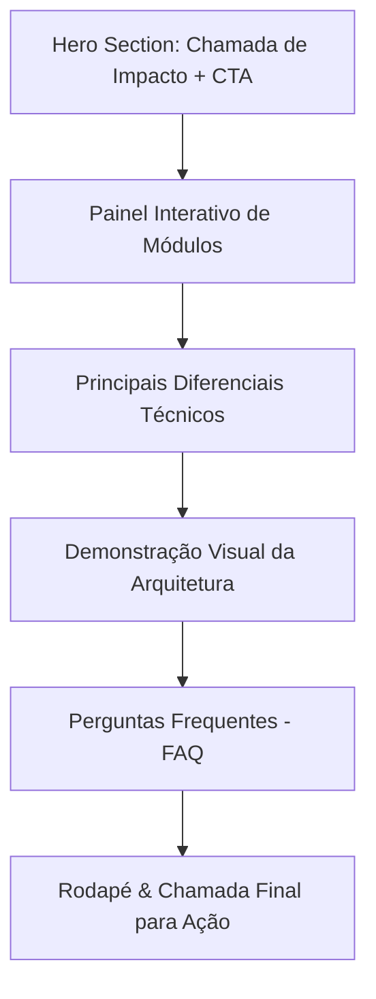

# Plano de Ação: Landing Page ADVO (Página de Apresentação)

Este documento apresenta o plano de ação detalhado para a criação de uma **Landing Page premium** para o **ADVO - Sistema de Advocacia**. A página foi desenhada para refletir a mesma identidade visual e qualidade técnica do sistema desenvolvido (tema dark premium, moderno, rápido e responsivo).

---

## 🎨 Design System e Identidade Visual

Para manter total harmonia com a plataforma interna, a Landing Page deve seguir as seguintes diretrizes:

*   **Paleta de Cores**:
    *   Fundo principal: `#0b0f19` (azul escuro profundo) a `#111827` (grafite) em degradê.
    *   Superfícies (cards/seções): `#1f2937` ou `rgba(31, 41, 55, 0.5)` com efeito *glassmorphism* (blur de fundo).
    *   Cor de destaque (Primary): Violeta/Indigo dinâmico (`#6366f1` a `#8b5cf6`).
    *   Cores de suporte: Verde Esmeralda (`#10b981`) para financeiro/sucesso e Dourado/Âmbar (`#f59e0b`) para alertas/status.
*   **Tipografia**:
    *   Títulos: `Outfit` ou `Playfair Display` (elegância jurídica moderna).
    *   Textos: `Inter` (legibilidade máxima).
    *   Código/Métricas: `JetBrains Mono` ou `Fira Code`.
*   **Efeitos e Transições**:
    *   *Glassmorphism*: bordas muito finas (`1px solid rgba(255,255,255,0.08)`) e `backdrop-filter: blur(12px)`.
    *   *Gradients*: Uso de gradientes sutis em botões e títulos principais.
    *   *Micro-animações*: Efeitos de hover suaves (`transition: all 0.3s cubic-bezier(0.4, 0, 0.2, 1)`).

---

## 🏛️ Estrutura e Seções Recomendadas



### 1. Hero Section (Seção Principal)
*   **Objetivo**: Prender a atenção do advogado/gestor em menos de 3 segundos.
*   **Texto Principal (Headline)**: *"A gestão jurídica do futuro, simples e em tempo real."*
*   **Subtexto**: *"Controle processos, gerencie prazos com calendário interativo, organize tarefas em Kanban e monitore seu fluxo de caixa em uma plataforma rápida, integrada e segura."*
*   **Chamadas para Ação (CTAs)**:
    *   Botão Primário: `"Começar Agora (Grátis)"` -> Aponta para a rota `/registro` do sistema.
    *   Botão Secundário: `"Acessar Minha Conta"` -> Aponta para a rota `/login`.
*   **Elemento Visual**: Um mockup flutuante da tela de Dashboard em dark mode, com uma leve sombra neon (`box-shadow: 0 20px 40px rgba(99, 102, 241, 0.15)`).

---

### 2. Painel Interativo de Módulos (Showcase)
Em vez de apenas listar recursos em formato de texto chato, propõe-se um componente de abas interativas (Tabs) que permite simular o funcionamento das **7 partes** criadas no projeto.

| Módulo | O que destacar na Landing Page | Elemento Visual Interativo |
| :--- | :--- | :--- |
| **1. Segurança & Acesso** | Autenticação robusta, renovação proativa de sessão e proteção contra inatividade. | Um pequeno terminal simulado mostrando a renovação de tokens JWT em tempo real. |
| **2. Clientes** | Cadastro completo de clientes com busca automática de endereço por CEP (ViaCEP). | Um campo de simulação onde o usuário digita um CEP e vê o endereço autocompletar instantaneamente. |
| **3. Processos** | Painel de controle de processos, com acompanhamento de movimentações e partes contrárias. | Um fluxo visual (timeline) simplificado de uma movimentação processual. |
| **4. Agenda** | Calendário interativo para controle de audiências, prazos e reuniões. | Um mini-calendário interativo onde o usuário pode arrastar um compromisso e ver a data atualizar. |
| **5. Tarefas** | Quadro Kanban para organizar o fluxo de trabalho do escritório. | Três colunas Kanban simuladas (A Fazer, Em Andamento, Concluído) que o usuário pode interagir. |
| **6. Documentos** | Upload seguro e rápido de petições, procurações e contratos diretamente anexados aos processos. | Uma área simulada de Dropzone com animação ao soltar um arquivo fictício. |
| **7. Financeiro** | Fluxo de caixa com totalizadores automáticos e controle de baixas de honorários. | Cards com valores (Receitas, Despesas e Saldo) que atualizam dinamicamente ao clicar em "Pagar" em uma conta fictícia. |

---

### 3. Diferenciais Técnicos e Arquitetura
Seção focada em transmitir robustez técnica para escritórios preocupados com estabilidade e velocidade.
*   **Velocidade Incrível (Vite + React)**: Sem travamentos ou telas de carregamento pesadas.
*   **API-Driven**: Comunicação direta e padronizada seguindo as especificações da OpenAPI.
*   **Segurança Avançada**: Controle estrito de permissões baseado em níveis de acesso (Admin, Advogado, Estagiário, Secretaria).
*   **Atualização Otimista**: Alterações no Kanban e na Agenda refletem instantaneamente, sincronizando em segundo plano para máxima fluidez.

---

### 4. Seção de FAQ (Perguntas Frequentes)
Perguntas sanadas usando um componente de sanfona (Accordion) com transições suaves:
*   *Como funciona a segurança dos meus dados?* (Foco no controle de tokens e expiração de sessão após 15 minutos de inatividade).
*   *Posso vincular despesas a processos específicos?* (Sim, o módulo financeiro permite associação direta a Clientes e Processos).
*   *Como funciona o cadastro de endereços?* (Utiliza integração em tempo real com a base do ViaCEP).

---

## 🛠️ Guia de Implementação (Passo a Passo)

Para criar essa Landing Page dentro do projeto atual ou como um arquivo estático separado:

### Passo 1: Configurar a Rota Pública
Se quiser hospedar a Landing Page na mesma aplicação React/Vite, crie um novo componente `LandingPage.jsx` sob `src/features/public/components/` e configure-o na rota raiz:
```jsx
// No routes/index.jsx
{
  path: '/',
  element: <LandingPage />
}
// E altere as rotas privadas para começar sob outro prefixo ou usar proteção direta
```

### Passo 2: Construir o CSS de Efeitos Visuais
Crie um arquivo `landing.css` focado em efeitos e animações especiais. Utilize variáveis de ambiente para manter consistência:
```css
.hero-gradient-text {
  background: linear-gradient(135deg, #a78bfa 0%, #6366f1 100%);
  -webkit-background-clip: text;
  -webkit-text-fill-color: transparent;
}

.glass-card {
  background: rgba(31, 41, 55, 0.45);
  backdrop-filter: blur(12px);
  border: 1px solid rgba(255, 255, 255, 0.08);
  border-radius: 16px;
  transition: transform 0.3s cubic-bezier(0.175, 0.885, 0.32, 1.275);
}

.glass-card:hover {
  transform: translateY(-5px);
  box-shadow: 0 10px 30px rgba(99, 102, 241, 0.1);
}
```

### Passo 3: Implementar o Simulador Kanban Simples (Interação da Landing)
Adicione estados rápidos do React para criar interatividade sem complexidade de backend na Landing Page:
```javascript
const [cards, setCards] = useState([
  { id: 1, title: 'Elaborar Petição Inicial', status: 'todo' },
  { id: 2, title: 'Audiência de Conciliação', status: 'doing' }
]);

const moverTarefa = (id, novoStatus) => {
  setCards(prev => prev.map(c => c.id === id ? { ...c, status: novoStatus } : c));
};
```

### Passo 4: Implementar o Simulador de CEP (Interação da Landing)
Demonstre a integração da API do ViaCEP diretamente na Landing:
```javascript
const [cep, setCep] = useState('');
const [rua, setRua] = useState('');

const buscarCepDemo = async (valor) => {
  setCep(valor);
  if (valor.replace(/\D/g, '').length === 8) {
    const res = await fetch(`https://viacep.com.br/ws/${valor}/json/`);
    const data = await res.json();
    if (!data.erro) {
      setRua(`${data.logradouro}, ${data.bairro} - ${data.localidade}/${data.uf}`);
    }
  }
};
```

---

> [!IMPORTANT]
> **Próximo Passo Recomendado**: Decidir se a Landing Page fará parte da mesma aplicação SPA (criando a rota `/` no React Router e movendo as demais para `/app/*`) ou se será um projeto estático paralelo (HTML/CSS tradicional) para maximizar a otimização de SEO de carregamento inicial.
